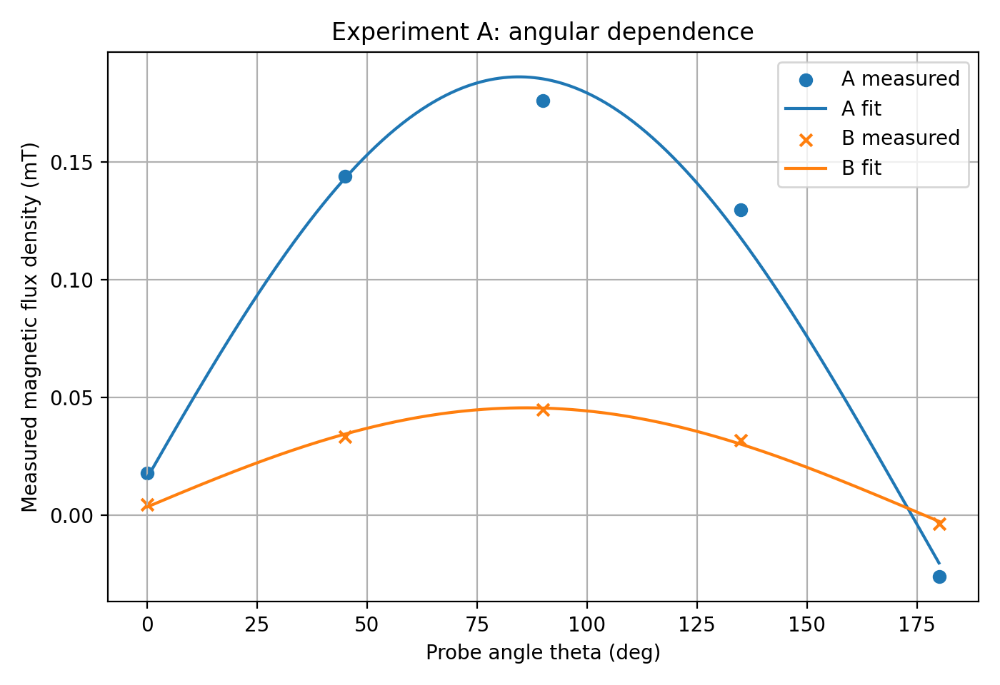
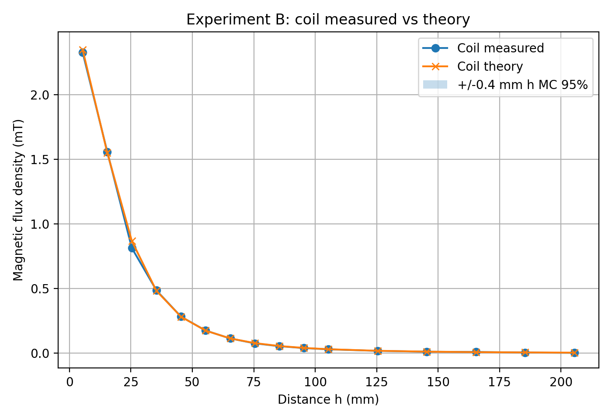
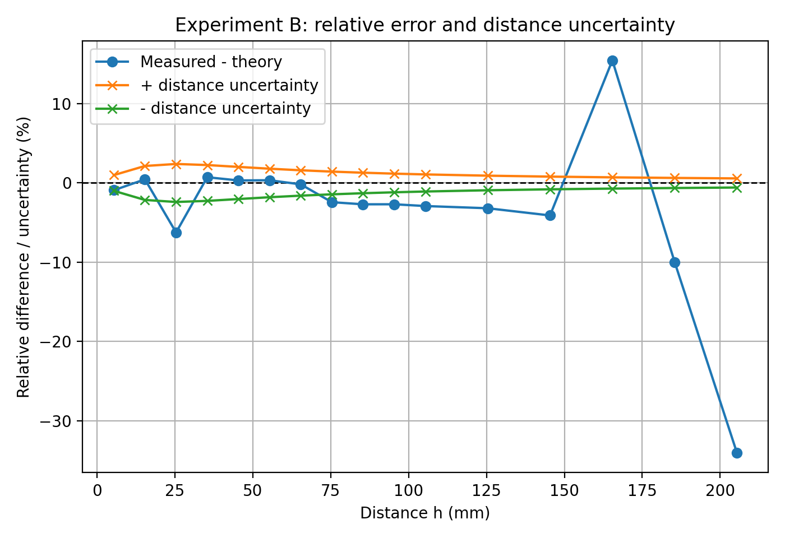
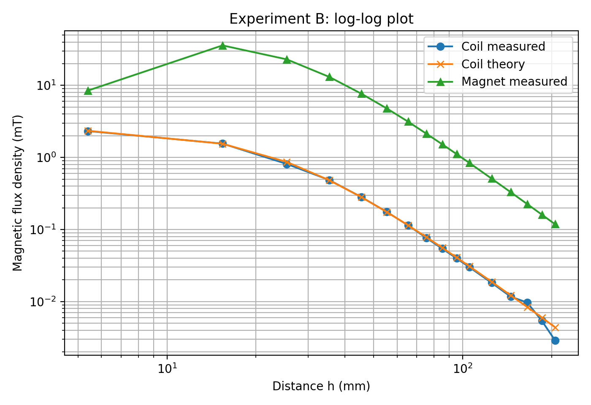
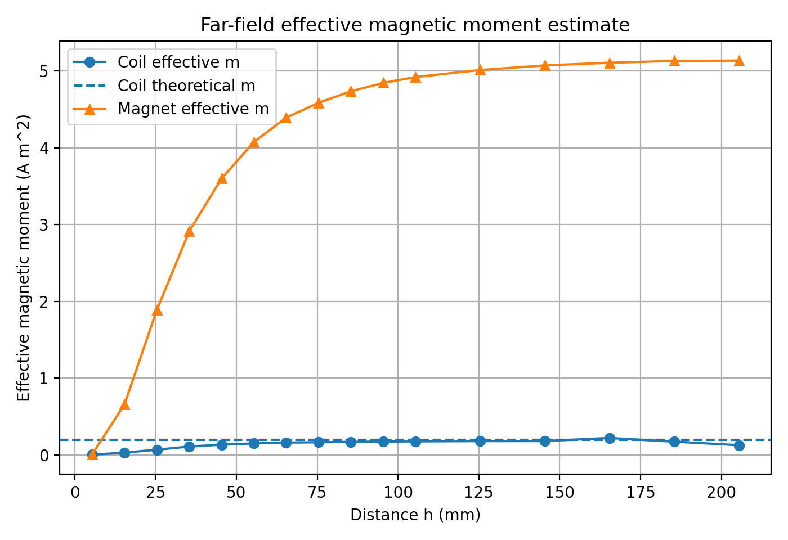

# 磁束密度の測定 解析結果

## 実験A: 角度依存フィット

ホールプローブの読みを次の式で近似した。

\[
B(\theta)=B_x\cos\theta+B_y\sin\theta+C
\]

| 点 | \(B_x\) / mT | \(B_y\) / mT | offset \(C\) / mT | \(|B|\) / mT | 主方向 |
| --- | ---: | ---: | ---: | ---: | ---: |
| A | 0.0181 | 0.1874 | -0.0022 | 0.1882 | \(84.5^\circ\) |
| B | 0.0031 | 0.0450 | 0.0005 | 0.0451 | \(86.1^\circ\) |

数値上はAもBも \(90^\circ\) 付近で最大になる。点Aでは磁場の大きさが約 \(0.188\,\mathrm{mT}\)、主方向が約 \(84.5^\circ\) と求まったので、磁場の主成分はおよそ \(90^\circ\) 方向である。一方、点Bも数値上は \(90^\circ\) 付近が主方向となったが、配置図では中心軸上にないと考えられるため、測定位置や角度基準のずれ、また磁場が小さいことによる相対的不確かさの影響を受けた可能性がある。

## 実験B: コイルの理論値との比較

円形コイルの理論式は次の式である。

\[
B(h)=\frac{\mu_0NIr^2}{2(h^2+r^2)^{3/2}}
\]

代表点での実測値と理論値の比較は次の通りである。

| \(h\) / mm | 実測値 / mT | 理論値 / mT | 相対誤差 |
| ---: | ---: | ---: | ---: |
| 5.4 | 2.3255 | 2.3471 | -0.92 % |
| 15.4 | 1.5583 | 1.5512 | +0.46 % |
| 25.4 | 0.8133 | 0.8675 | -6.25 % |
| 55.4 | 0.1755 | 0.1749 | +0.34 % |
| 205.4 | 0.0029 | 0.0044 | -34.09 % |

近距離から中距離ではおおむね数%以内で一致した。遠方の \(-34\%\) は相対誤差としては大きいが、絶対値では約 \(0.0015\,\mathrm{mT}\) の差である。そのため、理論式が破綻しているというより、遠方では磁束密度が小さくなり、ゼロ点ずれや周囲磁場が相対的に大きくなったと考えるのが自然である。

## 距離不確かさの伝播

距離の不確かさ \(\Delta h\) による相対不確かさは、次の式で見積もれる。

\[
\frac{\Delta B}{B}
\simeq
\frac{3h}{h^2+r^2}\Delta h
\]

ここでは \(r=25\,\mathrm{mm}\)、\(\Delta h=0.4\,\mathrm{mm}\) とした。

| \(h\) / mm | 距離による相対不確かさ | 実測値と理論値のずれ |
| ---: | ---: | ---: |
| 5.4 | 約 1.0 % | -0.92 % |
| 15.4 | 約 2.1 % | +0.46 % |
| 25.4 | 約 2.4 % | -6.25 % |
| 55.4 | 約 1.8 % | +0.34 % |
| 105.4 | 約 1.1 % | -2.91 % |
| 205.4 | 約 0.6 % | -34.09 % |

\(h=5.4\), \(15.4\), \(55.4\,\mathrm{mm}\) などは距離不確かさの範囲でかなり説明できる。一方、\(h=25.4\,\mathrm{mm}\) の \(-6.25\%\) は距離不確かさだけではやや大きく、遠方の \(-34\%\) は距離不確かさでは説明できない。

## モンテカルロ評価

距離の真値を

\[
h_{\rm true}=h_{\rm measured}+\delta h,\qquad
\delta h \sim {\rm Uniform}(-0.4,\ 0.4)\,\mathrm{mm}
\]

と仮定し、理論値のばらつきをモンテカルロシミュレーションで評価した。

近距離から中距離の一部では実測値が理論値の95%範囲内に入った。しかし、\(h=25.4\,\mathrm{mm}\) や \(h\ge75.4\,\mathrm{mm}\) の多くの点では、距離の不確かさだけでは実測値と理論値の差を説明しきれなかった。これらの点では、プローブの中心軸からのずれ、角度のずれ、ゼロ点ずれ、周囲磁場なども影響していたと考えられる。

## 両対数フィット: \(B\propto h^{-n}\)

両対数グラフで

\[
\log B = a + b\log h
\]

をフィットした。傾き \(b\) が \(-3\) に近ければ、遠方で \(B\propto h^{-3}\) に近いことを意味する。

| 対象 | フィット範囲 | 傾き \(b\) | \(R^2\) |
| --- | --- | ---: | ---: |
| コイル | 全点 | -1.96 | 0.913 |
| コイル | \(h\ge35.4\,\mathrm{mm}\) | -2.81 | 0.991 |
| コイル | \(h\ge55.4\,\mathrm{mm}\) | -2.96 | 0.989 |
| コイル | \(h\ge75.4\,\mathrm{mm}\) | -3.05 | 0.983 |
| 磁石 | 全点 | -1.57 | 0.746 |
| 磁石 | \(h\ge35.4\,\mathrm{mm}\) | -2.72 | 0.998 |
| 磁石 | \(h\ge55.4\,\mathrm{mm}\) | -2.84 | 1.000 |
| 磁石 | \(h\ge75.4\,\mathrm{mm}\) | -2.89 | 1.000 |

\(h\ge55.4\,\mathrm{mm}\) で見ると、コイルは \(b=-2.96\)、磁石は \(b=-2.84\) であり、どちらも \(-3\) に近い。したがって、遠方ではコイルも磁石も磁気双極子のようにふるまうと考えられる。

## 有効磁気モーメント

遠方の双極子近似

\[
B=\frac{\mu_0 m}{2\pi h^3}
\]

から、

\[
m_{\rm eff}=\frac{2\pi Bh^3}{\mu_0}
\]

で有効磁気モーメントを見積もった。

- コイルの理論的磁気モーメント: \(m_{\rm coil}=NI\pi r^2=0.196\,\mathrm{A\,m^2}\)
- 遠方データから見積もったコイルの中央値: \(m_{\rm eff}\simeq0.173\,\mathrm{A\,m^2}\)
- 遠方データから見積もった磁石の中央値: \(m_{\rm mag}\simeq5.01\,\mathrm{A\,m^2}\)

磁石の有効磁気モーメントは、今回のコイルの理論値に対して

\[
\frac{5.01}{0.196}\simeq25.5
\]

倍程度と見積もられる。これは磁石の磁束密度がコイルよりかなり大きかったことと整合する。

## 磁石の近距離データ

磁石では \(h=5.4\,\mathrm{mm}\) で \(B=8.488\,\mathrm{mT}\) なのに対して、\(h=15.4\,\mathrm{mm}\) で \(B=35.94\,\mathrm{mT}\) となっている。これは単純な点双極子近似では説明しにくい。

近距離では磁石の形状、穴の有無、端面付近の磁場分布、プローブ位置のずれが強く影響するため、近距離データを \(B\propto h^{-3}\) の検証に使うのは適切ではない。磁石の \(h^{-3}\) 的なふるまいを見るなら、近距離データを除いて遠方側で評価するのがよい。

## 生成ファイル

- [実験A: 角度依存フィット](experiment_A_angular_fit.png)
- [実験B: コイル測定値・理論値・モンテカルロ範囲](experiment_B_coil_measured_theory_MC.png)
- [実験B: コイル相対誤差と距離不確かさ](experiment_B_coil_relative_error_uncertainty.png)
- [実験B: コイルと磁石の両対数グラフ](experiment_B_loglog_coil_magnet.png)
- [有効磁気モーメントの見積もり](effective_magnetic_moment.png)
- [コイル誤差・不確かさ表 CSV](coil_error_uncertainty_table.csv)
- [両対数フィット結果 CSV](power_law_fit_table.csv)
- [有効磁気モーメント表 CSV](effective_moment_table.csv)
